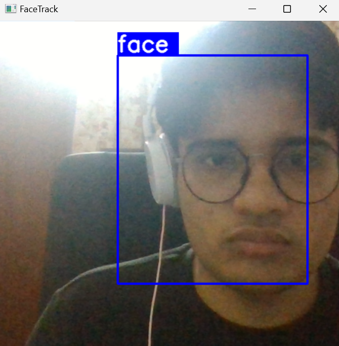

# Face Recognition

## Running the Face Detection Model

To run the face detection model, follow these steps:

1. Open the `Real_time_detection.ipynb` file.
2. Run the provided code within the notebook.
3. This code accesses your webcam and detects whether your face is captured by the camera.

## Webcam Code Adjustment

If the webcam code isn't working, you can make the following adjustment:

- Change `VideoCapture(0)` to `VideoCapture(1)` within the notebook.
- This modification allows you to access your webcam. It might be necessary if you have multiple cameras connected to your system.

## Output Photo Storage

The output photos captured by the face detection model are stored in the `output` folder. You can find the detected face images there.

